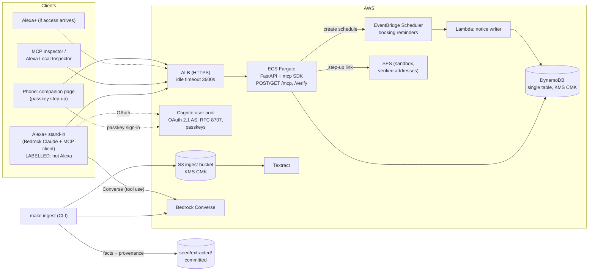
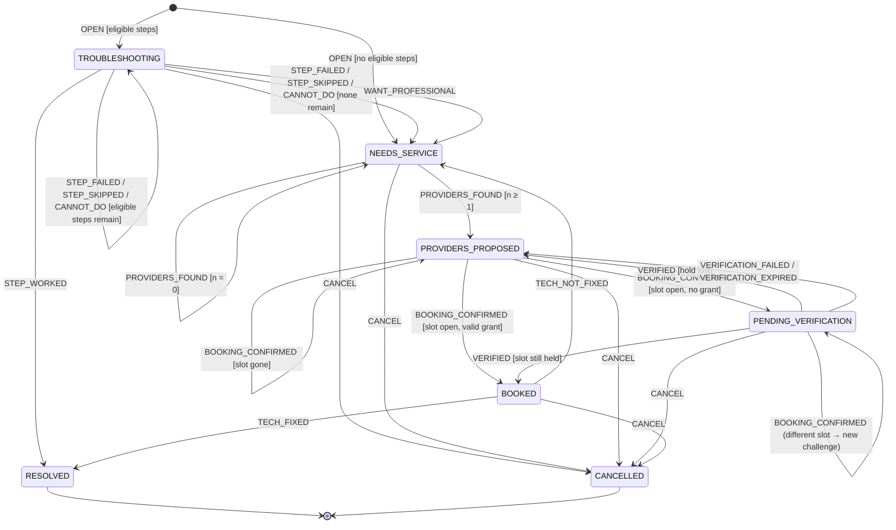
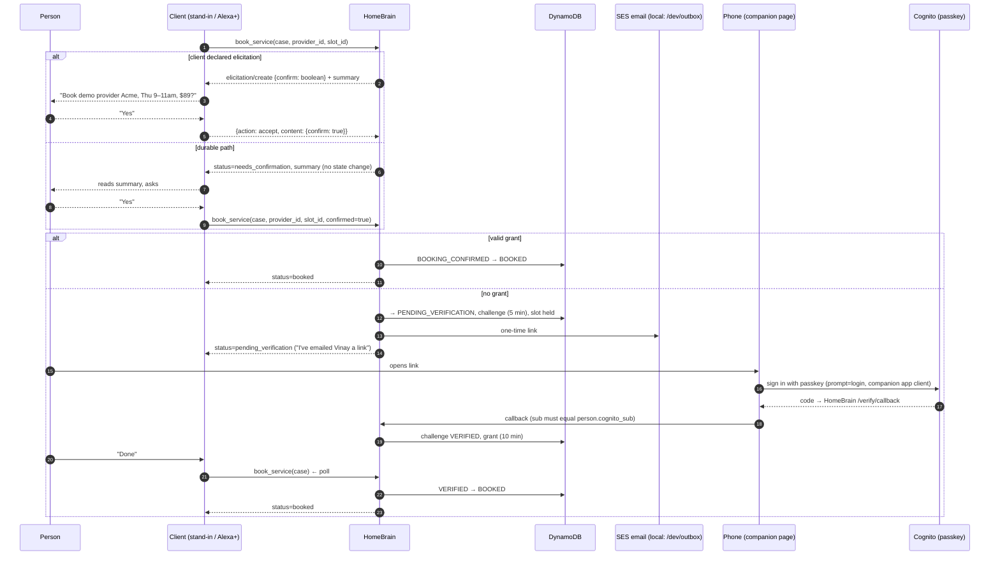

# HomeBrain: Design

**Status:** Approved scope, revision 2 (after three review rounds)
**Date:** 2026-09-25
**Deadline:** demo video recorded by **Fri 16 Oct 2026**. Submission closes **Fri 23 Oct 2026**. We aim to submit **Wed 21 Oct**.

> **Alexa knows who is in the room. HomeBrain decides what that person is allowed to do.**

HomeBrain is a self-hosted MCP server that gives an Alexa+ household a durable memory for home operations. It knows what the household owns, what's covered, and who is probably asking. It runs repair cases that last many turns and many days. It doesn't recognise voices, and it never claims to.

---

## 0. Decision log

### 0.1 Decisions made in review

| # | Decision | Consequence |
|---|---|---|
| D1 | **Tier 3 step-up uses a Cognito passkey.** No voiceprint. SMS is cut. | Amazon Connect Voice ID reached end of support on 20 May 2026 ([AWS](https://docs.aws.amazon.com/connect/latest/adminguide/amazonconnect-voiceid-end-of-support.html)). A passkey is device-bound and confirmed with the phone's biometric. That's **stronger** than a voiceprint, which a recording or a synthetic voice can fool. We say so plainly. |
| D2 | **SMS OTP is cut.** Links are delivered by SES email. | US SMS needs 10DLC or toll-free registration, which takes weeks. SES starts in sandbox mode and only sends to verified addresses. The seed household's addresses are verified **in Terraform** (§13). |
| D3 | **`search_home_documents` is cut, and with it Bedrock Knowledge Bases.** | This is **conditional** on ingestion staying genuinely real: Textract OCR plus Bedrock Converse extraction, correct page numbers, and a test on every fact (§8). If that's ever at risk, we stop and escalate. We never stub it. |
| D4 | If search comes back, **S3 Vectors** is the default vector store. OpenSearch Serverless can be swapped in with an env var. | No spend on a $170/month floor. Recorded in ADR-006. |
| D5 | **Assume no Alexa+ MCP Toolkit access.** | Nothing in the demo depends on it. The test path is MCP Inspector plus Amazon's **Local Inspector**. The web simulator is an "if access arrives" section. |
| D6 | **The Alexa+ stand-in client is a core deliverable.** It's built in week 1, straight after G1. | "Alexa+ stand-in: Bedrock Claude driving the same MCP tools Alexa+ would call." It's labelled on screen and in the README. We never imply it's Alexa (§9). |
| D7 | **WAF is cut** to pay for D6. | It's a production gap, recorded in ADR-008. An ALB has no rate limiting, so we use an **in-app token bucket** instead (§12). |
| D8 | **Booking stays a `DEMO_FIXTURE`**, shaped like the UCP checkout lifecycle. | Real Alexa+ checkout needs Amazon Pay merchant onboarding or stored cards, and we'd be the merchant of record for someone else's repair. ADR-007 shows where real checkout plugs in. The spoken text always says "demo provider". |
| D9 | **Recording runs against the local stack.** The extraction output comes from **one real `make ingest` run** and is committed together with a provenance file. | This meets the brief's "demo never depends on live AWS" rule without faking the AI. DEMO.md shows the run. |
| D10 | **Local Inspector's `certification-verdict.json` is a deliverable.** | It's committed to the repo and gets a README section. |
| D11 | US locale, USD, US addresses, `distributionCountries: ["US"]`. | — |
| D12 | `guest_can_report` is false by default and **true in the demo seed household**. | The guest path appears in the video. |
| D13 | No X-Ray. Structured JSON logs in CloudWatch only. | ADR-012. |
| D14 | `reveal_policy_number` and attribute-level encryption are cut. | Policy numbers are always masked. Tables and buckets still use a KMS CMK. |

### 0.2 Platform facts this design depends on

These were checked on 2026-09-25.

- **Latency:** Alexa+ requires a round trip under 500 ms ([quickstart](https://developer.amazon.com/docs/alexaplus/add-ons/mcp-toolkit-quickstart.html)). **No Bedrock calls on the tool hot path**; the server reads DynamoDB only.
- **Auth:** Alexa+ doesn't support DCR, CIMD, OIDC or MCP step-up authorization. It expects `401` **without** `WWW-Authenticate`. Scopes are `mcp:service`, `mcp:tools` and `mcp:resources`. Both grant types are used: `client_credentials` and `authorization_code`+PKCE ([auth](https://developer.amazon.com/docs/alexaplus/add-ons/mcp-toolkit-authentication.html)).
- **Resource binding:** Cognito supports RFC 8707 and puts the resource in the access token's `aud` claim ([Cognito](https://docs.aws.amazon.com/cognito/latest/developerguide/cognito-user-pools-define-resource-servers.html)). Our middleware checks it anyway.
- **Elicitation:** Alexa+ doesn't document elicitation support. A blocking elicitation also can't meet 500 ms. So we have two confirmation paths (§6.9).
- **The SDK (checked in step 2):** `mcp` 2.2.0 negotiates up to protocol `2026-07-28` and still supports `2025-11-25`. Under `2026-07-28`, elicitation is **stateless**: the server returns `InputRequiredResult`, and the client retries with `input_responses` and `request_state`. That works across tasks and holds no call open. Under `2025-11-25`, which Alexa+ uses, the request is still sent mid-call. We'll use the SDK's `Elicit` resolver, which picks the right mode per session. The durable path is still needed for clients that don't declare elicitation.
- **No push:** an MCP server can't start a conversation. Proactive messages arrive attached to the next tool response (§7).
- **Onboarding:** Amazon's Add-on Agent Skill comes with the `alexa-ai` CLI. We use it to scaffold the add-on manifest, and stop before `deploy`, because deploying needs Toolkit access. The CLI is **downloaded from the Alexa Developer Console** after login. **The `alexa-ai` package on public npm is an unrelated third-party WhatsApp bot. Never install it.**
- **Local Inspector:** it's also downloaded from the Developer Console; it isn't on public npm. `addon-local-inspector <url>` needs Node.js 24+. Its data-layer checks cover tool definitions, payloads, errors and latency. Its visual checks need `ui://` resources, which we don't have.

---

## 1. Scope

### 1.1 In scope (what the video shows)

1. "What's under warranty?" → `list_household_assets`
2. "The dishwasher's full of water. Is it covered?" → `get_asset_coverage`, with a citation to the warranty card's page.
3. A case opens → `open_service_case`. The first DIY step is **chosen for the person speaking**.
4. Steps across turns, remembering what was tried → `advance_case`
5. Unresolved → `find_service_providers` (demo providers)
6. Book → `book_service`: confirmation (elicitation, or the durable path), then **passkey step-up on the phone**.
7. Booking reminders are scheduled automatically.
8. "Days later" (the clock is moved on, and says so on screen): another member asks "what's happening with the dishwasher?" → `get_case_status`, with the reminder notice attached.
9. Guest path: a guest reports a problem (allowed in the seed household) and is refused a booking.
10. `make ingest` output traced back to a real PDF page.

### 1.2 Cut, and what we lose

| Cut | Lost |
|---|---|
| `search_home_documents`, Bedrock KB | Open-ended questions over documents |
| `get_person_preferences`, `set_person_preference` | Reading or changing preferences by voice. Seeded preferences still drive behaviour. |
| `schedule_reminder` | User-created reminders. Booking reminders still happen. |
| States `AWAITING_CONFIRMATION`, `CLOSED` | A stored record of half-confirmed bookings; reopening a case |
| Warranty-expiry sweep | Proactive warranty warnings |
| Remembering tried steps across cases | Remembering them within a case still works |
| SMS OTP | Phone-number delivery. Email only. |
| Event-driven ingestion (S3 → Lambda → DLQ) | Automatic ingestion of new uploads. `make ingest` is a command instead. |
| WAF | Managed rule protection. There is an app rate limit. |
| `reveal_policy_number` | A second sensitive-action example |
| X-Ray | Distributed traces |

---

## 2. Architecture



- **Hot path:** DynamoDB only. Scheduler and SES calls happen after the state transition commits. They're tiny, but if one fails the booking still stands and the failure is logged. There's no SQS worker in the cut scope; see §11 for the budget.
- **Local:** docker-compose runs the server, DynamoDB Local and the stand-in. The Scheduler, SES and verifier are replaced by labelled local adapters. The stand-in is the only local component that calls AWS (Bedrock), and it has a replay mode (§9).
- **Why ECS Fargate + ALB** (ADR-001): App Runner caps request duration, and API Gateway + Lambda buffers responses. Both fight SSE on `GET /mcp`. Fargate tasks run in public subnets with the security group limited to the ALB, so we don't pay for a NAT gateway.

---

## 3. The case state machine

This is a pure function, `transition(case, event, ctx) -> Result[(case', effects), Rejection]`. It has no I/O. Effects are returned as data and carried out by the application layer. The target is 100% branch coverage.

### 3.1 Diagram



**Confirmation is stateless.** `book_service` without `confirmed: true` returns a summary and changes nothing. Only an explicit yes produces `BOOKING_CONFIRMED`. That's why there is no `AWAITING_CONFIRMATION` state.

### 3.2 States

| State | Group | Meaning | What the assistant does next |
|---|---|---|---|
| `TROUBLESHOOTING` | active | A DIY step is current. | Read `current_step`, then ask whether it worked. |
| `NEEDS_SERVICE` | active | DIY is exhausted, declined or not suitable. | Offer to find providers. |
| `PROVIDERS_PROPOSED` | active | Providers and slots are stored. | Ask which one, confirm, then book. |
| `PENDING_VERIFICATION` | active | Confirmed, the slot is held, waiting for the passkey. | "Check your email on your phone." Poll on the next turn. |
| `BOOKED` | active | Appointment held, reminders scheduled. | Report it. After the visit, ask whether it's fixed. |
| `RESOLVED` | terminal | Fixed. A new problem opens a new case. | — |
| `CANCELLED` | terminal | Abandoned. | — |

**Invariant:** at most one active case per `(household, asset)`. `open_service_case` on an asset that already has one returns that case with `already_open: true`.

### 3.3 Events (14)

| Event | Source | Payload |
|---|---|---|
| `OPEN` | `open_service_case` | asset, problem, symptom, candidate steps, acting person |
| `STEP_WORKED` / `STEP_FAILED` / `STEP_SKIPPED` / `CANNOT_DO` | `advance_case` | step_id? |
| `WANT_PROFESSIONAL` | `advance_case` | — |
| `PROVIDERS_FOUND` | `find_service_providers` | providers[], window |
| `BOOKING_CONFIRMED` | `book_service` (`confirmed: true` or an accepted elicitation) | provider_id, slot_id, quote |
| `VERIFIED` / `VERIFICATION_FAILED` / `VERIFICATION_EXPIRED` | a challenge check on any tool call that touches the case | challenge_id |
| `TECH_FIXED` / `TECH_NOT_FIXED` | `advance_case` | — |
| `CANCEL` | `advance_case` | reason? |

Any `(state, event)` pair not in the diagram is rejected with `INVALID_TRANSITION`. The error lists `allowed_outcomes` for the current state.

### 3.4 Guards

- **Eligible step:** `step.diy_level ≤ acting_person.diy_tolerance` (`none < basic < confident`), the step isn't unsafe for the person's role, and its status is `pending`. It's evaluated **when the next step is chosen, for whoever is speaking then**. If Vinay (`confident`) opens the case and Priya (`none`) answers, Priya isn't handed a step that means pulling the filter out.
- **Valid grant:** a `VerificationGrant` exists for the acting person, `now < expires_at` (TTL 10 min), and `method_strength ≥ STRONG`. The stub counts as STRONG **only** when `HB_ENV=local`, and the screen says STUB.
- **Slot open / held:** the `BookingGateway` holds the slot when the checkout session is created. `VERIFIED` completes that session.
- **Challenge binding:** `VERIFIED` counts only if `challenge.action_digest == sha256(household|person|case|provider|slot|price)`.
- **Role:** `BOOKING_CONFIRMED` needs role `owner` or `adult`. The tool layer enforces this before the event exists.

### 3.5 Effects

| Transition | Effects |
|---|---|
| `→ PENDING_VERIFICATION` | `CreateCheckoutSession` (holds the slot), `IssueChallenge(ttl 5 min)`, `DeliverChallenge(email)` |
| `→ BOOKED` | `CompleteCheckoutSession`, `ScheduleReminder(slot.start − 1 day, ALL)`, `ScheduleReminder(slot.end + 2 h, "Did the technician fix it?")`, `EmitNotice(ALL)`, `RevokeChallenge` |
| `PENDING_VERIFICATION → PROVIDERS_PROPOSED` / `→ CANCELLED` from PENDING | `CancelCheckoutSession`, `RevokeChallenge` |
| `BOOKED → CANCELLED` | `CancelCheckoutSession`, `CancelReminders` |
| any | `AppendCaseEvent`, `BumpVersion` |

### 3.6 Steps within a case

Steps are copied into the case at `OPEN` from the asset's extracted troubleshooting steps for the matched symptom. Copying means a later re-ingest can't change a case that's in flight.

```
Step { step_id, step_key, order, instruction, detail?, diy_level, safety_warning?,
       status: pending|current|worked|failed|skipped|cannot_do,
       outcome_by?: person_id, outcome_at?, citation }
```

At most one step is `current`, and only in `TROUBLESHOOTING`.

**Symptom matching** is lexical and deterministic. The `problem` text is normalised and scored against each symptom's extracted `phrases[]`. If nothing matches, the case opens in `TROUBLESHOOTING` with the asset's general steps, and the response lists `known_symptoms` so the assistant can ask a follow-up.

### 3.7 Concurrency and idempotency

- The case has a `version` number. A transition is one `TransactWriteItems`: a conditional `Put` of the case (`version = :expected`), a `Put` of the `CaseEvent`, and any notice or reminder item. If the condition fails, we reload and retry once. Otherwise we return `CONFLICT` with the fresh case.
- **Duplicate outcomes:** if `advance_case` names a `step_id` that already has the same outcome recorded, we return `duplicate: true` and don't transition again.
- **Duplicate bookings:** booking is idempotent on `(case_id, provider_id, slot_id)`.

### 3.8 Tests

- A table-driven test over every `(state, event, guard outcome)` cell, including every rejection.
- Hypothesis property tests: random event sequences never break the invariants. At most one current step. Terminal states have no outgoing edges. `BOOKED` implies a completed checkout. `PENDING_VERIFICATION` implies a live challenge and a held slot.
- `pytest --cov-branch --cov-fail-under=100` over `homebrain/domain/`, enforced in CI.

---

## 4. Identity

### 4.1 Framing (the same wording is used in README and IDENTITY.md)

**Alexa knows who is in the room. HomeBrain decides what that person is allowed to do.**

- Alexa+ recognises voices. HomeBrain doesn't, and doesn't claim to. An MCP tool call carries no audio and no voice-profile id.
- HomeBrain combines three signals: the linked account (certain), the name the speaker gave (a hint), and a passkey on the person's own phone (proof).
- For sensitive actions, **a passkey is stronger than the retired voiceprint service would have been**. It's bound to a device the person holds and unlocked by that device's biometric. It can't be replayed from a recording or faked with a cloned voice.

### 4.2 Tiers

| Tier | Answers | Source | Trust |
|---|---|---|---|
| 1. Household | Which household? | Access token `sub`, looked up in `IdentityLink` | Authoritative. **Never** taken from a tool argument. |
| 2. Person | Who is probably speaking? | §4.3 | Best effort. Personalises only. **Never** grants permission. |
| 3. Verified person | Is it really them? | Passkey step-up (§4.5) | Strong. Needed for sensitive actions. |

### 4.3 Resolving the person (Tier 2)

The first rule that matches wins.

```
a. explicit id  ← request._meta[HB_PERSON_META_KEY], if configured and present
                   (Alexa+ doesn't send one today. Off by default.)   → "explicit", high
b. speaker_hint ← tool argument
                   normalise (casefold, strip "this is"/"it's"/"I'm"),
                   match display_name, then aliases, then difflib ratio ≥ 0.85
                   1 match → "speaker_hint", medium   >1 → PERSON_AMBIGUOUS   0 → "guest"
c. no hint      → household.default_person_policy
                   "owner" (default) → account owner, "account_owner_assumed", low
                   "guest"           → guest
```

Every response carries `acting_person`, so the assistant can say "I've assumed this is Ram. Tell me if it isn't."

### 4.4 Permissions

| Action | owner | adult | child | guest | Needs Tier 3? |
|---|---|---|---|---|---|
| List assets, check coverage (policy numbers always masked), case status | ✓ | ✓ | ✓ | ✓ | no |
| Open or advance a case, find providers | ✓ | ✓ | ✓ | only if `guest_can_report` (default false; **true in the seed**) | no |
| **Book a paid service** | ✓ | ✓ | ✗ | ✗ | **yes** |
| Change a member's access | ✓ | ✗ | ✗ | ✗ | yes. Not built; it's a documented future admin page. |

Denials return `FORBIDDEN_FOR_GUEST` or `FORBIDDEN_FOR_ROLE`, with an `ask_user` line.

### 4.5 Step-up (Tier 3)



- **Challenge:** a 128-bit random id. The link token is HMAC-signed with a key from Secrets Manager. It's one-time use: status moves `PENDING → VERIFIED|FAILED` by conditional write. Five failures in an hour lock step-up for 15 minutes.
- **Passkey:** a separate Cognito app client (`companion`) with managed login and passkeys enabled. Each adult member is a Cognito user in the same pool, linked by `Person.cognito_sub`, and enrols a passkey once. `prompt=login` forces a fresh passkey check. The callback checks that the ID token's `sub` matches the challenge's person. This is still to be confirmed during week 3: whether passkeys work on the Cognito prefix domain or need a custom domain (§15, Q1).
- **Local:** `StubVerifier` shows a page with a big **STUB — Approve** button. `/dev/outbox` shows **DEV OUTBOX — NOT A REAL EMAIL**.
- **Polling:** any tool that touches a case in `PENDING_VERIFICATION` checks the challenge first.

```python
class StepUpVerifier(Protocol):
    method: VerificationMethod  # "stub" | "passkey"
    strength: Strength  # NONE < WEAK < STRONG

    def begin_url(self, challenge: VerificationChallenge) -> str: ...
    async def complete(
        self, challenge: VerificationChallenge, proof: Mapping[str, str]
    ) -> VerificationOutcome: ...
```

---

## 5. Data model (DynamoDB, single table)

### 5.1 Access patterns

| # | Pattern | Used by | Served by |
|---|---|---|---|
| AP1 | Household from token `(iss, sub)` | every call | GetItem `IDLINK#<iss_hash>#<sub>` |
| AP2 | Household profile + members (with preferences and grants) | every call | Query `PK=HH#h`, `SK between "HH" and "PERSON#~"` |
| AP3 | List a household's assets | `list_household_assets`, asset resolution | Query `PK=HH#h`, `SK begins_with ASSET#`, filter `type=ASSET` |
| AP4 | One asset with coverage facts and steps | coverage, open case | Query `PK=HH#h`, `SK begins_with ASSET#<a>` |
| AP5 | A case with its event history | case tools | Query `PK=HH#h`, `SK begins_with CASE#<c>` |
| AP6 | Cases by status (and the active case for an asset) | status, dedup, resolving a case by asset name | **GSI1** `GSI1PK=HH#h#CASE`, `GSI1SK begins_with ACTIVE#[<state>#]` |
| AP7 | Challenge by id | companion page, polling | GetItem `CHAL#<id>` |
| AP8 | Unheard notices for a person + household-wide | every call | Query `SK begins_with NOTICE#<p>#` and `NOTICE#ALL#` |
| AP9 | Providers and slots for a region (fixture) | `find_service_providers`, booking | Query `PK=DIR#<region>` |

Plus direct key lookups (`REM#r` for the notice-writer Lambda). The hot path per call is AP1 + AP2 (cached 60 s per token) + AP8.

### 5.2 Keys

IDs are prefixed ULIDs (fixed width), so `begins_with ASSET#a_<ulid>` can't match a different asset.

| Entity | PK | SK | GSI1PK / GSI1SK | TTL |
|---|---|---|---|---|
| IdentityLink | `IDLINK#<iss_hash>#<sub>` | `IDLINK` | | |
| Household | `HH#h` | `HH` | | |
| Person (includes preferences) | `HH#h` | `PERSON#p` | | |
| VerificationGrant | `HH#h` | `PERSON#p#GRANT` | | 10 min |
| Asset | `HH#h` | `ASSET#a` | | |
| Coverage fact | `HH#h` | `ASSET#a#COV#<id>` | | |
| Troubleshooting step fact | `HH#h` | `ASSET#a#TS#<symptom>#<order>` | | |
| Document (provenance) | `HH#h` | `DOC#d` | | |
| Case | `HH#h` | `CASE#c` | `HH#h#CASE` / `<ACTIVE\|DONE>#<state>#<updated_at>#c` | |
| CaseEvent | `HH#h` | `CASE#c#EVT#<ts>#<seq>` | | |
| VerificationChallenge | `CHAL#id` | `CHAL` | | expiry + 1 d |
| Reminder | `HH#h` | `REM#r` | | |
| Notice | `HH#h` | `NOTICE#<p\|ALL>#<ts>#<id>` | | 30 d |
| Provider (fixture) | `DIR#<region>` | `PROV#id` | | |
| Slot (fixture) | `DIR#<region>` | `PROV#id#SLOT#<start>` | | |

- **One GSI.** GSI1 projects `ALL`. There's no GSI2.
- **Preferences** (`service_window`, `diy_tolerance`, `language`, `email`) are a map on the `Person` item. The brief's `Preference` entity is folded into it, because we cut the preference tools.
- **Notices:** a household-wide notice records per-person delivery in `delivered_to`. Each person hears it once.

### 5.3 Main attributes

```
Household   { household_id, name, timezone, region, default_person_policy, guest_can_report, owner_person_id }
Person      { person_id, display_name, aliases[], role, email_masked, email_ref, cognito_sub?,
              prefs { service_window, diy_tolerance, language } }
Asset       { asset_id, name, aliases[], category, brand, model_number, purchase_date,
              owner_person_ids[], warranty_summary { status, expires_on },
              symptoms[] { symptom_key, phrases[] }, source_document_ids[] }
Coverage    { source_type, provider_name, starts_on, expires_on, conditions[], exclusions[],
              deductible?, policy_number_masked?, citation }
Citation    { document_id, document_title, document_type, page, quote, extracted_by }
Document    { document_id, title, document_type, asset_ids[], sha256, pages,
              extraction_ref  → seed/extracted/provenance.json entry }
Case        { case_id, asset_id, problem_text, symptom_key, state, steps[], providers[],
              pending_booking?, booking?, checkout_session_id?, challenge_id?,
              reminder_ids[], opened_by, opened_at, updated_at, version }
CaseEvent   { event_type, from_state, to_state, by_person_id, resolution, at, summary }
Challenge   { challenge_id, household_id, person_id, case_id, action_digest, method,
              status, expires_at, attempts }
Reminder    { reminder_id, case_id, fire_at, audience, kind: booking_eve|post_visit, message, status }
Notice      { notice_id, audience, kind, text, case_id?, delivered_to }
```

**No PII in logs.** Logs carry ids, the resolution tier, the tool name, latency and the outcome. They never carry names, emails, problem text or quotes.

---

## 6. MCP tool contracts (7 tools)

### 6.1 Shared rules

- **Protocol** `2025-11-25`, Streamable HTTP, `POST /mcp` + `GET /mcp`. Server capability: `tools` (`listChanged: false`). We use client **elicitation** whenever the client declares it.
- **The household comes from the token.** No tool takes a household id.
- **Natural-language references:** `asset` ("the dishwasher", "Priya's car") and `case` (an asset phrase or a case id). If a reference is ambiguous, we return candidates and never guess.
- **Every tool** takes an optional `speaker_hint`, returns `structuredContent` that matches its `outputSchema`, and returns one spoken-style `text` block of 2–3 sentences with no ids.
- **Tool errors** use `isError: true` with the same envelope. Protocol errors use JSON-RPC codes.
- **Dates** are ISO 8601 with offset, in the household's timezone.
- **Anything from a fixture** carries `data_source: "DEMO_FIXTURE"`, and the text says "demo provider".

### 6.2 Envelope (`outputSchema` base)

```json
{
  "$schema": "https://json-schema.org/draft/2020-12/schema",
  "type": "object",
  "required": ["ok", "acting_person", "result", "notices", "suggested_next", "error"],
  "properties": {
    "ok": { "type": "boolean" },
    "acting_person": { "$ref": "#/$defs/ActingPerson" },
    "result": { "type": ["object", "null"] },
    "notices": { "type": "array", "items": { "$ref": "#/$defs/Notice" },
                 "description": "Things the household hasn't heard yet. Mention them briefly before answering." },
    "suggested_next": { "type": "array", "items": { "$ref": "#/$defs/SuggestedNext" } },
    "error": { "oneOf": [{ "type": "null" }, { "$ref": "#/$defs/Error" }] }
  },
  "$defs": {
    "ActingPerson": {
      "type": "object",
      "required": ["person_id", "display_name", "resolution", "confidence", "verified"],
      "properties": {
        "person_id": { "type": ["string", "null"] },
        "display_name": { "type": "string" },
        "resolution": { "enum": ["explicit", "speaker_hint", "account_owner_assumed", "guest"] },
        "confidence": { "enum": ["high", "medium", "low", "none"] },
        "verified": { "type": "boolean" },
        "verified_until": { "type": ["string", "null"], "format": "date-time" },
        "note_for_assistant": { "type": ["string", "null"] }
      }
    },
    "Citation": {
      "type": "object",
      "required": ["document_id", "document_title", "document_type", "page", "quote", "extracted_by"],
      "properties": {
        "document_id": { "type": "string" },
        "document_title": { "type": "string" },
        "document_type": { "enum": ["manual", "warranty", "insurance_policy", "invoice", "service_record"] },
        "page": { "type": "integer", "minimum": 1 },
        "quote": { "type": "string", "maxLength": 300 },
        "extracted_by": { "enum": ["textract+bedrock", "test_fixture"],
                          "description": "The demo seed loader refuses anything except textract+bedrock." }
      }
    },
    "AssetRef": {
      "type": "object", "required": ["asset_id", "name"],
      "properties": { "asset_id": { "type": "string" }, "name": { "type": "string" },
                      "brand": { "type": "string" }, "model_number": { "type": "string" } }
    },
    "Notice": {
      "type": "object", "required": ["notice_id", "kind", "text"],
      "properties": {
        "notice_id": { "type": "string" },
        "kind": { "enum": ["booking_tomorrow", "post_visit_check", "case_update"] },
        "text": { "type": "string" },
        "case_id": { "type": ["string", "null"] }
      }
    },
    "SuggestedNext": {
      "type": "object", "required": ["tool", "why"],
      "properties": { "tool": { "type": "string" }, "why": { "type": "string" },
                      "ask_user": { "type": ["string", "null"] } }
    },
    "Error": {
      "type": "object", "required": ["code", "message", "retryable"],
      "properties": {
        "code": { "enum": [
          "VALIDATION", "ASSET_NOT_FOUND", "ASSET_AMBIGUOUS", "CASE_NOT_FOUND", "CASE_AMBIGUOUS",
          "PERSON_AMBIGUOUS", "FORBIDDEN_FOR_GUEST", "FORBIDDEN_FOR_ROLE", "INVALID_TRANSITION",
          "CONFLICT", "NO_DOCUMENTS", "NO_PROVIDERS", "SLOT_UNAVAILABLE",
          "VERIFICATION_FAILED", "VERIFICATION_EXPIRED", "VERIFICATION_LOCKED",
          "RATE_LIMITED", "UPSTREAM_UNAVAILABLE" ] },
        "message": { "type": "string" },
        "ask_user": { "type": ["string", "null"], "description": "A specific question that would unblock this." },
        "retryable": { "type": "boolean" },
        "field": { "type": ["string", "null"] },
        "candidates": { "type": "array", "items": { "type": "object", "required": ["id", "label"],
          "properties": { "id": { "type": "string" }, "label": { "type": "string" } } } },
        "allowed_values": { "type": "array", "items": { "type": "string" } }
      }
    },
    "Step": {
      "type": "object", "required": ["step_id", "order", "instruction", "diy_level", "status", "citation"],
      "properties": {
        "step_id": { "type": "string" }, "order": { "type": "integer" },
        "instruction": { "type": "string" }, "detail": { "type": ["string", "null"] },
        "diy_level": { "enum": ["none", "basic", "confident"] },
        "safety_warning": { "type": ["string", "null"] },
        "status": { "enum": ["pending", "current", "worked", "failed", "skipped", "cannot_do"] },
        "outcome_by": { "type": ["string", "null"] },
        "citation": { "$ref": "#/$defs/Citation" }
      }
    },
    "Booking": {
      "type": "object", "required": ["provider_id", "provider_name", "slot_start", "slot_end", "data_source"],
      "properties": {
        "provider_id": { "type": "string" }, "provider_name": { "type": "string" },
        "slot_start": { "type": "string", "format": "date-time" },
        "slot_end": { "type": "string", "format": "date-time" },
        "estimated_cost": { "type": "object", "properties": {
          "amount": { "type": "number" }, "currency": { "const": "USD" }, "note": { "type": "string" } } },
        "covered_by_warranty": { "type": "boolean" },
        "reference": { "type": ["string", "null"] },
        "data_source": { "const": "DEMO_FIXTURE" }
      }
    },
    "StepUp": {
      "type": "object", "required": ["status", "method", "expires_at"],
      "properties": {
        "status": { "enum": ["pending_verification", "verified", "failed", "expired", "locked"] },
        "method": { "enum": ["stub", "passkey"] },
        "delivered_to_masked": { "type": ["string", "null"] },
        "expires_at": { "type": "string", "format": "date-time" },
        "instructions": { "type": "string" }
      }
    },
    "Outcome": { "enum": [
      "worked", "did_not_work", "skipped", "cannot_do", "want_professional",
      "technician_fixed_it", "technician_did_not_fix", "cancel" ] },
    "CaseView": {
      "type": "object",
      "required": ["case_id", "asset", "state", "state_label", "steps", "allowed_outcomes", "version"],
      "properties": {
        "case_id": { "type": "string" },
        "asset": { "$ref": "#/$defs/AssetRef" },
        "problem": { "type": "string" },
        "state": { "enum": ["TROUBLESHOOTING", "NEEDS_SERVICE", "PROVIDERS_PROPOSED",
                            "PENDING_VERIFICATION", "BOOKED", "RESOLVED", "CANCELLED"] },
        "state_label": { "type": "string", "description": "A plain-English status, ready to speak." },
        "opened_by": { "type": "string" },
        "opened_at": { "type": "string", "format": "date-time" },
        "updated_at": { "type": "string", "format": "date-time" },
        "current_step": { "oneOf": [{ "type": "null" }, { "$ref": "#/$defs/Step" }] },
        "steps": { "type": "array", "items": { "$ref": "#/$defs/Step" } },
        "steps_tried": { "type": "integer" },
        "steps_remaining": { "type": "integer" },
        "allowed_outcomes": { "type": "array", "items": { "$ref": "#/$defs/Outcome" } },
        "providers": { "type": "array", "items": { "$ref": "#/$defs/Provider" } },
        "pending_booking": { "oneOf": [{ "type": "null" }, { "$ref": "#/$defs/Booking" }] },
        "booking": { "oneOf": [{ "type": "null" }, { "$ref": "#/$defs/Booking" }] },
        "step_up": { "oneOf": [{ "type": "null" }, { "$ref": "#/$defs/StepUp" }] },
        "reminders": { "type": "array", "items": { "type": "object", "properties": {
          "fire_at": { "type": "string", "format": "date-time" }, "message": { "type": "string" } } } },
        "recent_history": { "type": "array", "maxItems": 5, "items": { "type": "object", "properties": {
          "at": { "type": "string", "format": "date-time" }, "by": { "type": "string" },
          "summary": { "type": "string" } } } },
        "version": { "type": "integer" }
      }
    },
    "Provider": {
      "type": "object", "required": ["provider_id", "name", "kind", "slots", "data_source"],
      "properties": {
        "provider_id": { "type": "string" }, "name": { "type": "string" },
        "kind": { "enum": ["manufacturer_authorized", "independent"] },
        "covered_by_warranty": { "type": "boolean" },
        "rating": { "type": "number" }, "distance_miles": { "type": "number" },
        "estimated_cost": { "type": "object", "properties": {
          "amount": { "type": "number" }, "currency": { "const": "USD" }, "note": { "type": "string" } } },
        "slots": { "type": "array", "maxItems": 3, "items": { "type": "object",
          "required": ["slot_id", "start", "end", "label"],
          "properties": { "slot_id": { "type": "string" },
                          "start": { "type": "string", "format": "date-time" },
                          "end": { "type": "string", "format": "date-time" },
                          "label": { "type": "string" } } } },
        "data_source": { "const": "DEMO_FIXTURE" }
      }
    }
  }
}
```

**Shared input property** (on every tool):

```json
"speaker_hint": { "type": "string", "maxLength": 60,
  "description": "The name the speaker gave for themselves in this conversation, e.g. 'Vinay' from 'this is Vinay'. Leave it out if they haven't said. Never guess." }
```

### 6.3 `list_household_assets`

**Description:** "Lists the appliances, vehicles and systems this household owns, with each one's warranty status and any open repair case. Use when the user asks what they own, what's under warranty, or what's expiring soon. To check whether one item is covered for a specific problem, use get_asset_coverage."
**Annotations:** readOnly, idempotent, closed-world.

```json
{ "type": "object", "additionalProperties": false,
  "properties": {
    "category": { "enum": ["appliance", "vehicle", "hvac", "electronics", "other"] },
    "owner": { "type": "string", "maxLength": 60, "description": "A household member's name, or 'me'." },
    "warranty_status": { "enum": ["active", "expiring_soon", "expired", "unknown"],
                         "description": "'expiring_soon' means within 60 days." },
    "speaker_hint": { "$ref": "#/speaker_hint" } } }
```

**Result:** `{ total, filters_applied, assets: [{ asset_id, name, category, brand, model_number, purchase_date, owners[], warranty: { status, expires_on, days_remaining }, open_case: { case_id, state } | null }] }`. An empty result says so out loud; it's never silent.

### 6.4 `get_asset_coverage`

**Description:** "Checks whether one specific item is covered by a manufacturer warranty, an extended warranty or an insurance policy, and cites the document and page it came from. Pass the user's problem as 'issue' so conditions and exclusions can be checked."
**Annotations:** readOnly, idempotent, closed-world.

```json
{ "type": "object", "additionalProperties": false, "required": ["asset"],
  "properties": {
    "asset": { "type": "string", "minLength": 1, "maxLength": 120,
               "description": "The item as the user named it, e.g. 'the dishwasher'." },
    "issue": { "type": "string", "maxLength": 300, "description": "What is wrong, in the user's words." },
    "speaker_hint": { "$ref": "#/speaker_hint" } } }
```

**Result:**
```json
{ "type": "object", "required": ["asset", "overall", "coverages"],
  "properties": {
    "asset": { "$ref": "#/$defs/AssetRef" },
    "overall": { "enum": ["covered", "likely_covered", "not_covered", "unknown"],
                 "description": "'likely_covered' means in date, but the issue may hit a condition. Say which." },
    "coverages": { "type": "array", "items": { "type": "object",
      "required": ["source_type", "status", "citation"],
      "properties": {
        "source_type": { "enum": ["manufacturer_warranty", "extended_warranty", "home_insurance", "auto_insurance"] },
        "provider_name": { "type": "string" },
        "status": { "enum": ["active", "expired", "not_started", "unknown"] },
        "starts_on": { "type": ["string", "null"], "format": "date" },
        "expires_on": { "type": ["string", "null"], "format": "date" },
        "days_remaining": { "type": ["integer", "null"] },
        "conditions": { "type": "array", "items": { "type": "string" } },
        "exclusions_matched": { "type": "array", "items": { "type": "string" } },
        "deductible": { "type": ["string", "null"] },
        "policy_number_masked": { "type": ["string", "null"] },
        "citation": { "$ref": "#/$defs/Citation" } } } } } }
```

**Errors:** `ASSET_NOT_FOUND` (lists all asset names as candidates), `ASSET_AMBIGUOUS`, `NO_DOCUMENTS` (`overall: unknown`).

### 6.5 `open_service_case`

**Description:** "Starts a repair case when something in the home is broken or misbehaving. It records the problem, checks coverage, and returns the first troubleshooting step suited to the person speaking. If the item already has an open case, that case is returned instead. Report what happens next with advance_case."
**Annotations:** not readOnly, not destructive, idempotent per asset, closed-world.

```json
{ "type": "object", "additionalProperties": false, "required": ["asset", "problem"],
  "properties": {
    "asset": { "type": "string", "minLength": 1, "maxLength": 120 },
    "problem": { "type": "string", "minLength": 3, "maxLength": 500,
                 "description": "What the user said is wrong, in their words." },
    "speaker_hint": { "$ref": "#/speaker_hint" } } }
```

**Result:** `{ case: CaseView, already_open: boolean, coverage_summary: { overall, headline, citation }, symptom_match: { symptom_key, confidence: high|low|none, known_symptoms[] } }`.
**Errors:** `ASSET_NOT_FOUND`, `ASSET_AMBIGUOUS`, `FORBIDDEN_FOR_GUEST`.

### 6.6 `get_case_status`

**Description:** "Gets the current state of a repair case: what's been tried, what happens next, and any booking or reminder. Anyone in the household can ask, for example 'what's happening with the dishwasher?'. Leave 'case' empty to list every open case."
**Annotations:** readOnly\*, idempotent, closed-world. \*It completes a pending verification if the passkey step has already happened (ADR-013).

```json
{ "type": "object", "additionalProperties": false,
  "properties": {
    "case": { "type": "string", "maxLength": 120, "description": "The item's name or a case id. Leave empty for all open cases." },
    "include_closed": { "type": "boolean", "default": false },
    "speaker_hint": { "$ref": "#/speaker_hint" } } }
```

**Result:** `{ match: "by_case_id"|"by_asset"|"all_active", cases: [CaseView] }`. With no cases, it says so.

### 6.7 `advance_case`

**Description:** "Records what happened on a repair case and moves it forward, for example 'the reset didn't work', 'that fixed it', 'I'd rather get a professional', 'the technician fixed it' or 'cancel it'. Returns the next step or next action. Map the user's words to one of allowed_outcomes."
**Annotations:** not readOnly, not destructive, idempotent with `step_id`, closed-world.

```json
{ "type": "object", "additionalProperties": false, "required": ["outcome"],
  "properties": {
    "case": { "type": "string", "maxLength": 120,
              "description": "The item's name or a case id. Can be left out if there is exactly one open case." },
    "outcome": { "$ref": "#/$defs/Outcome" },
    "step_id": { "type": "string", "description": "From current_step. Optional." },
    "note": { "type": "string", "maxLength": 300 },
    "speaker_hint": { "$ref": "#/speaker_hint" } } }
```

**Outcome → event:** `worked→STEP_WORKED`, `did_not_work→STEP_FAILED`, `skipped→STEP_SKIPPED`, `cannot_do→CANNOT_DO`, `want_professional→WANT_PROFESSIONAL`, `technician_fixed_it→TECH_FIXED`, `technician_did_not_fix→TECH_NOT_FIXED`, `cancel→CANCEL`.
**Result:** `{ case: CaseView, transition: { from, to, event }, duplicate: boolean }`.
**Errors:** `INVALID_TRANSITION` (`allowed_values` plus `ask_user`), `CASE_AMBIGUOUS`, `CASE_NOT_FOUND` (suggests `open_service_case`), `CONFLICT`, `FORBIDDEN_FOR_GUEST`.

### 6.8 `find_service_providers`

**Description:** "Finds demo repair providers for a case that needs professional service, with their next available time slots. Warranty-authorised providers come first when the item is covered. Uses the person's preferred service window unless one is given. Book one with book_service."
**Annotations:** not readOnly (it stores the proposal on the case), idempotent, open-world.

```json
{ "type": "object", "additionalProperties": false,
  "properties": {
    "case": { "type": "string", "maxLength": 120 },
    "preferred_window": { "enum": ["weekday_morning", "weekday_afternoon", "weekday_evening", "weekend", "earliest"] },
    "speaker_hint": { "$ref": "#/speaker_hint" } } }
```

**Result:** `{ providers: [Provider] (max 3), window_used, window_source: argument|person_preference|household_default, case: CaseView }`.
**Errors:** `INVALID_TRANSITION` (still troubleshooting → `ask_user`: "Would you like to skip the remaining steps and get a professional?"), `NO_PROVIDERS`, `FORBIDDEN_FOR_GUEST`.

### 6.9 `book_service` (sensitive)

**Description:** "Books a demo provider's time slot for a repair case. It needs the user's explicit yes, and identity verification with a passkey on their phone. If it returns needs_confirmation, read the summary, ask, then call again with confirmed=true. If it returns pending_verification, tell the user to check their email on their phone, then call again with just the case."
**Annotations:** not readOnly, not destructive, idempotent, open-world.

```json
{ "type": "object", "additionalProperties": false,
  "properties": {
    "case": { "type": "string", "maxLength": 120 },
    "provider_id": { "type": "string", "description": "From find_service_providers. Leave out when checking on a pending verification." },
    "slot_id": { "type": "string" },
    "confirmed": { "type": "boolean", "description": "Set to true only after the user clearly said yes to the summary you read out." },
    "speaker_hint": { "$ref": "#/speaker_hint" } } }
```

**Result:** `{ status: booked|needs_confirmation|pending_verification|declined|verification_failed|slot_unavailable, confirmation_summary, booking: Booking|null, step_up: StepUp|null, case: CaseView }`.

| Call | State | Result |
|---|---|---|
| provider+slot, no `confirmed`, client has elicitation | PROVIDERS_PROPOSED | elicit → accept continues in the same call; decline/cancel → `declined` |
| provider+slot, no `confirmed`, no elicitation | PROVIDERS_PROPOSED | `needs_confirmation` (no state change) |
| `confirmed: true` | PROVIDERS_PROPOSED / PENDING_VERIFICATION | `booked`, `pending_verification` or `slot_unavailable` |
| `confirmed: false` | any | `declined` (no state change) |
| case only | PENDING_VERIFICATION | `booked` / still `pending_verification` / `verification_failed` |
| any | BOOKED with the same slot | `booked` (idempotent) |

**Errors:** `FORBIDDEN_FOR_GUEST`, `FORBIDDEN_FOR_ROLE`, `VALIDATION` (unknown provider or slot; valid ids as candidates), `VERIFICATION_LOCKED`, `INVALID_TRANSITION`.

---

## 7. Proactive behaviour (booking reminders only)

| Trigger | AWS | Local | Result |
|---|---|---|---|
| The day before the booking; 2 h after the slot | EventBridge Scheduler one-off schedule `hb-rem-<id>` → Lambda notice-writer | in-process loop on the `Clock` port | A `Notice` attached to the next tool response for anyone in the household |

**Deterministic time.** Everything reads the `Clock` port. The demo moves the clock on with `POST /dev/clock/advance`, which exists only when `HB_ENV=local`. The stand-in shows a **"⏩ Demo clock: +3 days"** banner when it happens.

---

## 8. Ingestion: `make ingest` (real, never stubbed)

1. `seed/generate_pdfs.py` (reportlab) writes 8 assets' manuals, warranty cards, an extended warranty, a home policy and an auto policy to `seed/pdfs/`. It also writes `seed/pdfs/<doc>.truth.json`, which records the exact text placed on every page. That file is the answer key.
2. `make ingest` uploads each PDF to the S3 ingest bucket and runs Textract `StartDocumentAnalysis` (FORMS + TABLES), polling until done.
3. It builds page-tagged text (`=== PAGE n ===`) and calls **Bedrock Converse** with a forced tool schema. Output: coverage terms, troubleshooting steps (with `diy_level`, safety warnings and symptom phrases), and asset facts. Every fact needs a `page` and a **verbatim** `quote`.
4. **Validation at ingest time:** a fact is kept only if its normalised quote appears in Textract's text for the page it claims. Rejected facts are listed in the run report. They aren't silently dropped.
5. Output goes to `seed/extracted/<doc>.json`, plus `seed/extracted/provenance.json`, which records: Textract job ids, the Bedrock model id, Bedrock request ids, the input sha256s, UTC timestamps, and the tool version. **Both are committed.**
6. The seed loader refuses any citation whose `extracted_by` isn't `textract+bedrock`, and any document with no provenance entry.

**Tests** (`tests/ingest/test_citations.py`, run in CI against the committed output):
- For **every** extracted fact, the quote appears on the claimed page in the generator's `truth.json`, and on no page before it.
- Every document in the seed has a provenance entry whose sha256 matches the committed PDF.

**If Textract or Bedrock misbehave, we stop and escalate. We never fall back to hand-written facts.**

---

## 9. Alexa+ stand-in client

> **"Alexa+ stand-in: Bedrock Claude driving the same MCP tools Alexa+ would call."**
> This banner is permanent on screen and in the README. It is not Alexa.

- **Shape:** `standin/`, a small FastAPI app on `:8081` serving one chat page (plain HTML/JS, no framework). Its backend is an **MCP client** (the `mcp` SDK's Streamable HTTP client) connected to HomeBrain with an OAuth bearer token: the local dev issuer when local, Cognito on AWS.
- **Loop:** Bedrock Converse with `toolConfig` generated from `tools/list`. Each `toolUse` → `tools/call` → `toolResult` (structuredContent as JSON), repeated until `end_turn`. The model id comes from an env var.
- **System prompt:** approximates Alexa+'s role: brief, spoken-style replies, read `notices` first, confirm before booking. It **doesn't** pass identity. The page has a "who's speaking" label for **viewers only**. The server finds out who's speaking only if the person says so ("this is Priya"). Nothing is passed that Alexa+ wouldn't pass.
- **Elicitation:** the client declares the `elicitation` capability and renders `elicitation/create` as a confirm card. This is how the video shows elicitation working.
- **Transparency panel:** each tool call and its result is shown collapsed next to the chat, so judges can see the MCP traffic.
- **Voice:** browser Web Speech API for spoken output, and input where Chrome supports it. No dependency. Typed input is the fallback.
- **Record / replay:** `STANDIN_MODE=live|record|replay`. Rehearsal records the Converse responses. Replay plays them back if Bedrock is slow or unavailable on recording day, with an on-screen **"REPLAY of recorded Bedrock responses"** label. The **MCP calls to HomeBrain always run live**, even in replay mode.

---

## 10. Testing and certification

| Layer | Tool | Deliverable |
|---|---|---|
| Domain | pytest + hypothesis, 100% branch coverage | CI badge |
| MCP contract | MCP Inspector, every tool with valid and invalid input | a checklist in `docs/inspector-checklist.md` |
| Alexa readiness | `addon-local-inspector <url>/mcp` (Node 24+) | **`certification/certification-verdict.json` + `inspection-summary.json` committed**, with a README section |
| Extraction | the citation tests in §8 | CI |
| End to end | a scripted stand-in conversation (replay mode) in CI | CI |
| Alexa+ web simulator | only if Toolkit access arrives | a DEMO.md section marked "if access arrives" |

---

## 11. Latency budget (server p95 < 300 ms)

| Tool | Work | Budget |
|---|---|---|
| all | JWT (JWKS cached), AP1+AP2 (cached 60 s), AP8 | 30 ms |
| `list_household_assets` | AP3 | 20 ms |
| `get_asset_coverage` | AP4 | 20 ms |
| `open_service_case` | AP3/AP4 + AP6 + transaction | 60 ms |
| `get_case_status`, `advance_case` | AP5/AP6 (+ AP7) + transaction | 50 ms |
| `find_service_providers` | AP9 + transaction | 50 ms |
| `book_service` | AP9 + transaction + SES send + 2× CreateSchedule | 200 ms |

`book_service` is the slowest. If it goes past budget when measured in step 5, the SES and Scheduler calls move to a background task after the response is sent.

---

## 12. Security

- **Tokens:** JWT signature checked against the JWKS. We check `iss`, `exp`, `token_use=access`, `aud == https://<host>/mcp`, the scope, and `client_id` against an allow-list. `client_credentials` tokens can only call `tools/list`.
- **Alexa quirks:** `AUTH_401_STYLE=alexa|spec`. We serve both `/.well-known/oauth-protected-resource` and `/.well-known/oauth-authorization-server`. If Cognito can't name a scope `mcp:tools`, the scope mapping is recorded in ADR-004.
- **Rate limit (replaces WAF):** an in-process token bucket per token `sub` and per source IP (from `X-Forwarded-For`, trusting the ALB only), on `/mcp` and `/verify`. It returns `RATE_LIMITED`. The limit is per task, not global; ADR-008 records this.
- **Encryption:** a KMS CMK for DynamoDB, S3, logs and Secrets Manager.
- **IAM:** one role per component, resource-scoped ARNs, no `*` resources. Actions that don't support resource-level permissions (some Textract and Bedrock calls) are listed in an ADR with their condition keys.
- **Transport:** HTTPS on the ALB (needs a domain; see §15 Q2). `Origin` validated on `/mcp`.
- **Logs:** structured JSON to CloudWatch. No PII (§5.3).

---

## 13. Ports and adapters

| Port | Local | AWS |
|---|---|---|
| `Clock`, `IdGen` | `FixedClock` (advanceable), ULID | system clock, ULID |
| Repositories (household, asset, case, challenge, notice, reminder) | in-memory (unit tests), DynamoDB Local (compose) | DynamoDB |
| `BookingGateway`: `create_session / update_session / complete_session / cancel_session` (UCP lifecycle) | **DEMO_FIXTURE** | **DEMO_FIXTURE** (ADR-007: real UCP checkout plugs in here) |
| `ProviderDirectory` | **DEMO_FIXTURE** | **DEMO_FIXTURE** in DynamoDB |
| `StepUpVerifier` | `StubVerifier` (**STUB**) | `PasskeyVerifier` (Cognito) |
| `ChallengeMailer` | `/dev/outbox` (**DEV**) | SES (sandbox; identities verified in Terraform) |
| `ReminderScheduler` | in-process loop | EventBridge Scheduler |
| `TokenValidator` | local RS256 issuer (keys in `.local/`, gitignored) | Cognito JWKS |
| Extraction (`make ingest` only) | none. It always calls real AWS. | Textract + Bedrock Converse |

`homebrain/domain` imports nothing from `boto3`, `fastapi` or `mcp`. CI checks this with a small AST test; no extra dependency.

---

## 14. Dependencies

| Package | Status |
|---|---|
| `mcp`, `fastapi`, `uvicorn`, `pydantic`, `boto3` | implied by the brief |
| `ruff`, `mypy`, `pytest`, `pytest-cov`, `pre-commit` | implied by the brief |
| `PyJWT[crypto]`, `hypothesis`, `reportlab`, `boto3-stubs`, `python-ulid` | **approved** |
| Node.js 24+, `@alexa-ai/addon-local-inspector` | **approved** (outside the Python toolchain) |
| `amazon/dynamodb-local` Docker image | implied (local stubs) |
| `aws-opentelemetry-distro` | **declined** |

Anything else needs asking first.

---

## 15. Plan (dated)

Most weeks you have about 6 hours, less in a week with a deadline. **Anything that needs you is put as early as possible.**

| When | Work | Needs you | Gate |
|---|---|---|---|
| **Wk 0** Fri 25 – Sun 27 Sep | Revise DESIGN.md. **Step 2**: skeleton, uv, compose, Makefile, pre-commit, CI, licence. Install the `alexa-ai` CLI and Local Inspector; scaffold the add-on without deploying. | **This weekend:** AWS budget alarm; Bedrock model access (`us-east-1`); 3 seed email addresses; Amazon developer account; **Q1 and Q2 below**. Review the skeleton (~1 h). | — |
| **Wk 1** Mon 28 Sep – Wed 30 Sep | **Step 3**: state machine (7 states, 14 events, 100% branch coverage), identity resolver, permissions. | Review (~1 h) | — |
| Thu 1 – Sat 3 Oct | **Step 4**: MCP server on in-memory storage, 7 tools, elicitation + durable path, local token issuer, local reminder loop, rate limit. MCP Inspector pass. | — | **G1 Sat 3 Oct:** full demo path through MCP Inspector, locally. |
| Sun 4 – Mon 5 Oct | **Stand-in client** (§9), with record/replay. | Try it for 30 min; flag any wording that sounds wrong. | Stand-in drives the whole demo path. |
| **Wk 2** Tue 6 Oct | Seed data: 3 people, 8 assets, PDFs + `truth.json`. `infra/ingest` Terraform module (S3 bucket + ingest role). | `tofu apply` of the ingest module with your credentials (~15 min) | — |
| Wed 7 Oct | **`make ingest`**, real run. Citation tests. Commit output + provenance. | — | Every fact passes its page check. **If not: stop and escalate.** |
| Thu 8 Oct | **Step 5**: DynamoDB adapter, DynamoDB Local in compose. Latency measured. | — | — |
| **Fri 9 Oct (morning)** | **Terraform realism check → tell you** whether Cognito + ECS/ALB fits in 3 days. | Read it (~5 min) | — |
| Fri 9 – Sun 11 Oct | **Step 6**, plan A: everything. Plan B (split): VPC, ECR, ECS/ALB/HTTPS, DynamoDB, KMS, S3, SES identities, Scheduler, teardown now; **Cognito moves to Mon 12 Oct**. | `tofu apply` / `destroy` runs (~1 h) | **G2 Sun 11 Oct:** `tofu apply` from nothing works; Local Inspector has run once. |
| **Wk 3** Mon 12 Oct | Cognito (plan B) or reminders on AWS (plan A). Commit the Local Inspector verdict. | — | — |
| Tue 13 Oct | **Passkey step-up**, time-boxed. | Enrol passkeys on your phone (~20 min) | **G3 Tue 13 Oct evening:** passkey works end to end. **If not:** the video uses the STUB (labelled), and passkey becomes "implemented, not demoed". |
| Wed 14 Oct | DEMO.md spoken lines; full rehearsal in record mode; fixes. | **Rehearsal (~2 h)** | Rehearsal under 3 min. |
| **Thu 15 Oct** | **Record.** | **Recording (~2–3 h)** | — |
| Fri 16 Oct | Re-record day, kept free. | only if needed | **Video done.** |
| **Wk 4** Sat 17 – Tue 20 Oct | Docs only: README + diagram, IDENTITY.md, ADRs, DEMO.md final. Teardown test. | Review docs (~1.5 h) | — |
| **Wed 21 Oct** | **Submit.** | Submit (~30 min) | Two days of margin before Fri 23 Oct. |

**If the plan slips, cut in this order** (least damage first):
1. Voice input on the stand-in (keep voice output).
2. The auto-reminder on AWS: the local scheduler still shows it in the video.
3. Passkey → the labelled stub (G3).
4. AWS deploy in the video: the README shows it; the video runs locally.

Never cut: the state machine, real ingestion, the stand-in, the video.

### Questions that need you this weekend

- **Q1. Passkey domain.** Cognito passkeys may need a custom domain for the WebAuthn relying party. I'll confirm on Mon 12 Oct at the latest. Not needed from you yet.
- **Q2. A domain name, needed by Fri 9 Oct.** An ALB can only serve HTTPS with an ACM certificate for a domain you own, and OAuth redirects plus Alexa+ need HTTPS.
  - Options: (a) register a cheap domain in Route 53 (about $3–15 a year; it can take up to a day), or (b) put CloudFront in front of the ALB and use its default `*.cloudfront.net` certificate. Option (b) needs SSE keep-alive pings, because CloudFront cuts idle connections.
  - **Decided: a custom domain, not CloudFront.** You'll confirm by Fri 9 Oct whether you already own a domain. If you do, we use a subdomain with a Route 53 hosted zone and an ACM certificate. **Nothing gets registered without asking you first.**
  - Terraform takes `domain_name` and `create_hosted_zone` as **variables**. No domain, account id or email ever appears in committed config. Real values live in an untracked `*.tfvars` file; a `*.tfvars.example` is committed.

---

## 16. ADRs to write (week 4, docs only)

| ADR | Title |
|---|---|
| 001 | ECS Fargate + ALB over App Runner / Lambda |
| 002 | Passkey step-up instead of Connect Voice ID (end of support); why it's stronger |
| 003 | Two confirmation paths: elicitation and durable confirmation |
| 004 | How Cognito meets Alexa+ auth: scopes, 401 style, RFC 8707 |
| 005 | Proactive behaviour through notices attached to the next response |
| 006 | Cutting document search; S3 Vectors (default) vs OpenSearch if it's restored |
| 007 | Booking as a DEMO_FIXTURE shaped like UCP; where real checkout plugs in |
| 008 | No WAF; in-app rate limit; production gap |
| 009 | DynamoDB Local instead of LocalStack |
| 010 | The Alexa+ stand-in client, and what it doesn't claim |
| 011 | Ingestion as a command, with committed output and provenance |
| 012 | CloudWatch structured logs, no X-Ray |
| 013 | `get_case_status` marked readOnly despite finishing verification |
